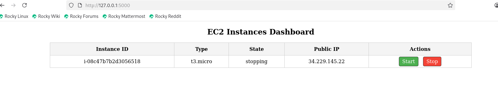

# 🚀 EC2 Dashboard - Flask Web App

A simple **web dashboard** built with **Flask** and **Boto3** to manage your **AWS EC2 instances** easily.

---

## 📌 Project Overview

This app allows you to:

- **View all EC2 instances** – See their **ID, type, state, and public IP** in a table.  
- **Start EC2 instances** – Click the **Start** button to turn on a stopped instance.  
- **Stop EC2 instances** – Click the **Stop** button to turn off a running instance.  
- **Manage infrastructure** directly from a web interface with a clean UI.

---

## 🛠️ Technologies Used

- **Python** – main programming language  
- **Flask** – web framework for the dashboard  
- **Boto3** – AWS SDK for Python to communicate with EC2  
- **HTML/CSS** – simple user interface  
- **AWS EC2** – cloud servers managed by this app  

---

## ⚙️ Setup Instructions

Follow these steps to run the app locally:

### 1️⃣ Clone the repository

```bash
git clone https://github.com/ahmedsaber90801-maker/EC2-Dashboard.git
cd EC2-Dashboard


# Create a virtual environment

python3 -m venv venv
source venv/bin/activate


#  Install dependencies

pip install -r requirements.txt


#      Configure AWS credentials

~/.aws/credentials

[default]
aws_access_key_id = YOUR_KEY
aws_secret_access_key = YOUR_SECRET
region = YOUR_REGION

5️⃣ Run the application

python app.py
Open your browser:
enter the IP

## 📷 Screenshot


 
